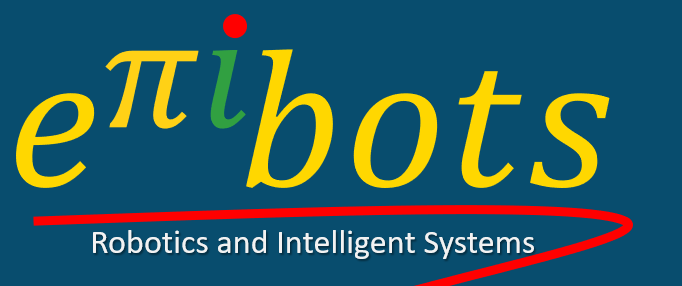

prof. Elias José de Rezende Freitas

[ResearchGate](https://www.researchgate.net/profile/Elias-J-R-Freitas)

Este site visa disponibilizar conteúdos interessantes em Robótica, Sistemas Embarcados, Visão Computacional e Sistemas Embarcados. Além de apresentar os projetos desenvolvidos pelo professor e pelos alunos envolvidos na pesquisa, ensino e extensão.

Inscreva-se e compartilhe também nosso canal:

Conheça o grupo de pesquisa: **[Robotics and Intelligent Systems - EPIIBOTS](https://ej-ensino.com.br/epiibots/)**

CNPQ: [http://dgp.cnpq.br/dgp/espelhogrupo/457477](http://dgp.cnpq.br/dgp/espelhogrupo/457477)
